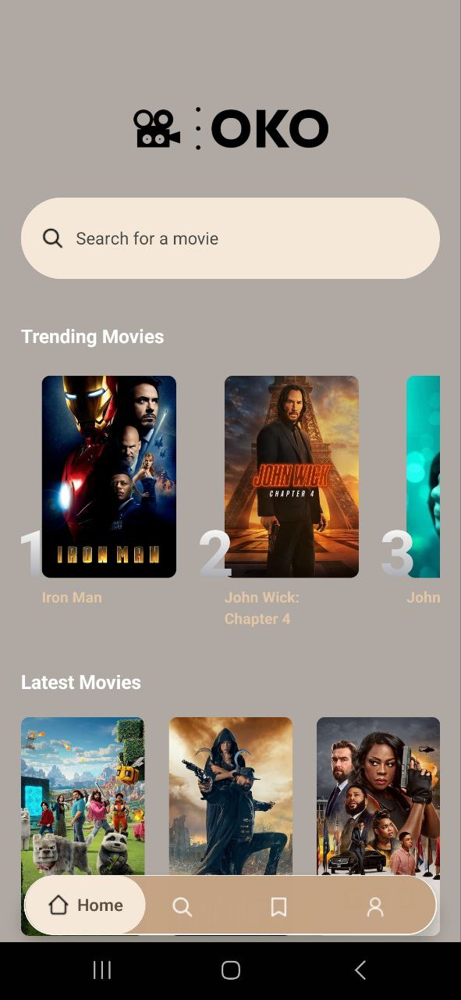
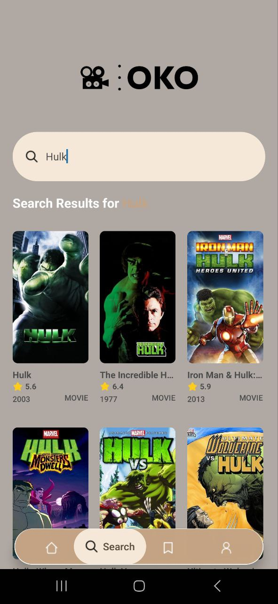
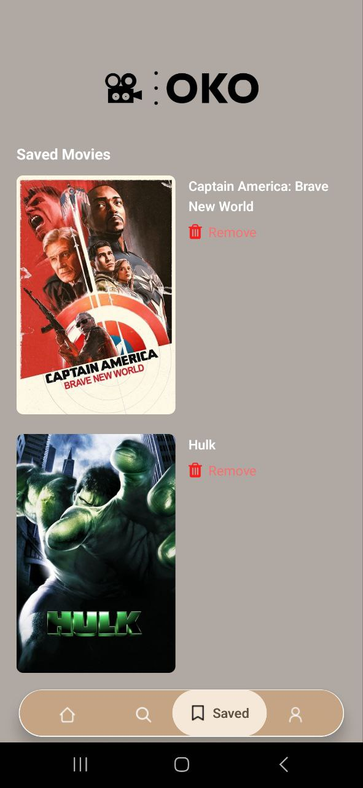
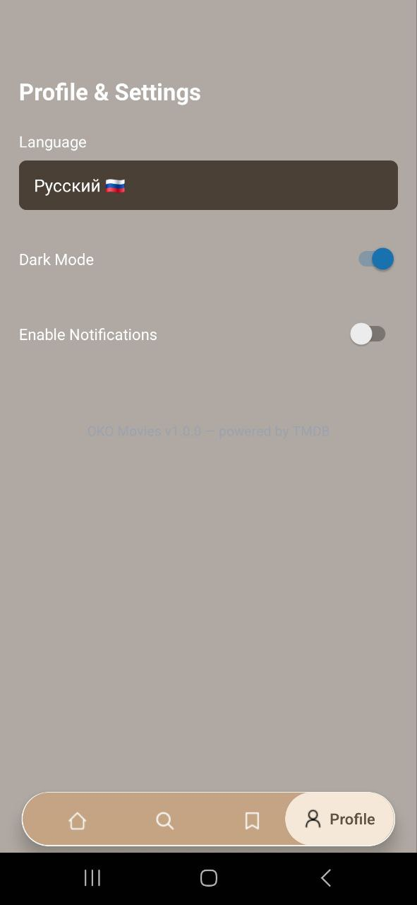
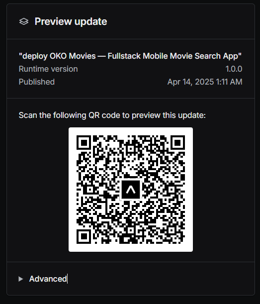

# 🎬 OKO Movies — Fullstack Mobile Movie Search App

**OKO Movies** is a fullstack mobile application powered by **React Native (Expo)** on the frontend and **Django + Django REST Framework** on the backend.  
It allows users to search for movies via TMDB, track trending movie searches, and view popular titles — all with beautiful mobile UI and backend sync.

---

## ✨ Features

- 🔍 Movie search using TMDB API
- 🔥 Trending movie tracking based on search popularity
- ❤️ Save/remove favorite movies using local storage
- 🚀 Redux Toolkit + AsyncThunk + Axios for state and API
- 🎨 NativeWind + Tailwind CSS for modern styling
- 🧠 TypeScript-first development
- ☁️ Backend on Django + PostgreSQL
- 📦 Deployed on [Render](https://render.com/)

---

---

## 📱 App Preview

### 🔥 Trending & Search Page → 🎬 Movie Details → 💾 Saved → ⚙️ Settings

<div style="display: flex; gap: 16px; overflow-x: auto; padding: 8px 0;"> 
    
    
    
    
</div>

### 🌍 Deploy QR Code


---

## 📁 Project Structure

```
/React_Native_Movies_OKO
│
├── frontend/                       # React Native app (Expo + Tailwind + Axios)
│   ├── app/                        # Expo Router pages (tabs, dynamic movie route)
│   ├── assets/                     # Fonts, icons, images
│   ├── backend/                    # Django backend (API, models, DB)
│      ├── manage.py
│      ├── movies_backend/          # Django config (settings, urls, wsgi)
│      └── requirements.txt         # Django project with DRF API
│   ├── components/                 # Reusable React Native components
│   ├── constants/                  # Shared constants (icons, images)
│   ├── hooks/                      # useAppDispatch/useAppSelector hooks
│   ├── store/                      # Redux Toolkit (movies, trending, saved)
│   ├── types/                      # TypeScript types/interfaces
│   ├── .env                        # Environment variables
│   ├── app.json                    # Expo config
│   └── package.json
```

---

## 🚀 Technologies Used

### Frontend
- React Native 0.76 + Expo SDK 52
- Expo Router
- Redux Toolkit + React Redux
- Axios for API calls
- NativeWind (Tailwind for RN)
- TypeScript

### Backend (Django)
- Django 5.1.7
- Django REST Framework
- PostgreSQL (via Render)
- Gunicorn (WSGI server)
- CORS headers

---

## ⚙️ Setup Instructions

### 🔧 Backend (Django)
1. Install dependencies:
   ```bash
   pip install -r requirements.txt
   ```

2. Run migrations:
   ```bash
   python manage.py migrate
   ```

3. Run the server:
   ```bash
   python manage.py runserver 0.0.0.0:8000
   ```

### 📱 Frontend (React Native)

1. Install dependencies:
   ```bash
   npm install
   ```

2. Start the Expo development server:
   ```bash
   npm start
   ```

3. Run on Android/iOS/Web:
   ```bash
   npm run android
   npm run ios
   npm run web
   ```

---

## 🌍 Environment Variables

### Backend
Make sure to define `.env` (or Render variables):

```env
DJANGO_SECRET_KEY=your_secret_key
DEBUG=False
ALLOWED_HOSTS=oko-movies-database.onrender.com
DATABASE_URL=postgres://...
```

### Frontend
In `app.json` or `.env`, store:

```env
EXPO_PUBLIC_MOVIE_API_KEY=your_tmdb_api_key
```

---

## 📡 Deployment

- **Backend**: Hosted on [Render](https://render.com/) using Gunicorn + PostgreSQL
- **Frontend**: Runs via Expo Go (local or deployed if needed)

---

## 📊 APIs

- [TMDB API](https://developers.themoviedb.org/3) — for movie search and details
- Django API:
  - `/api/trending-movies/` — trending search list
  - `/api/update-search-count/` — update trending stats

---

## 🙏 Credits

- Movie data: [TMDB](https://themoviedb.org)
- Icons: [Expo Vector Icons](https://icons.expo.fyi)
- UI: Custom-built, inspired by movie streaming platforms

---